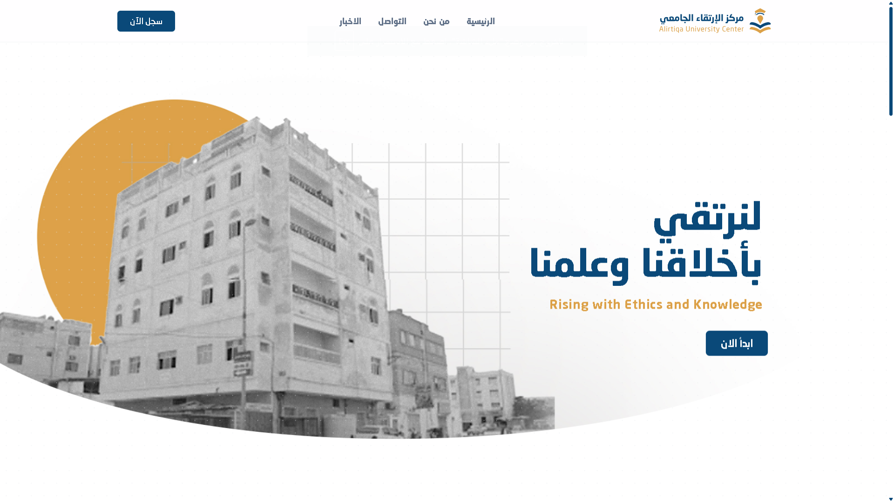
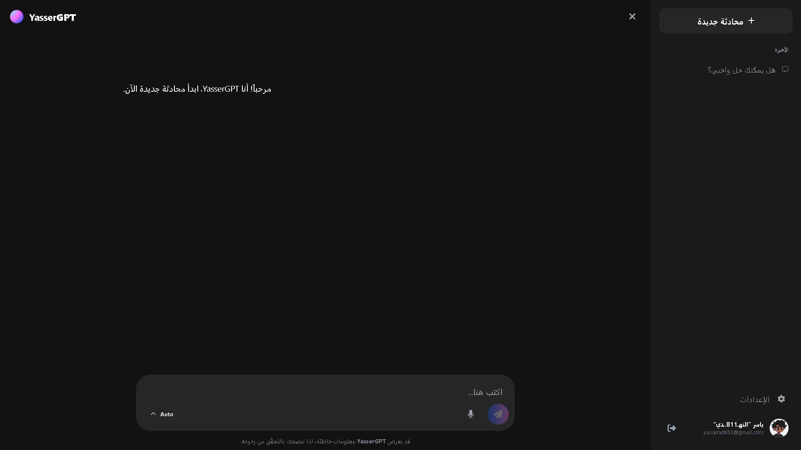
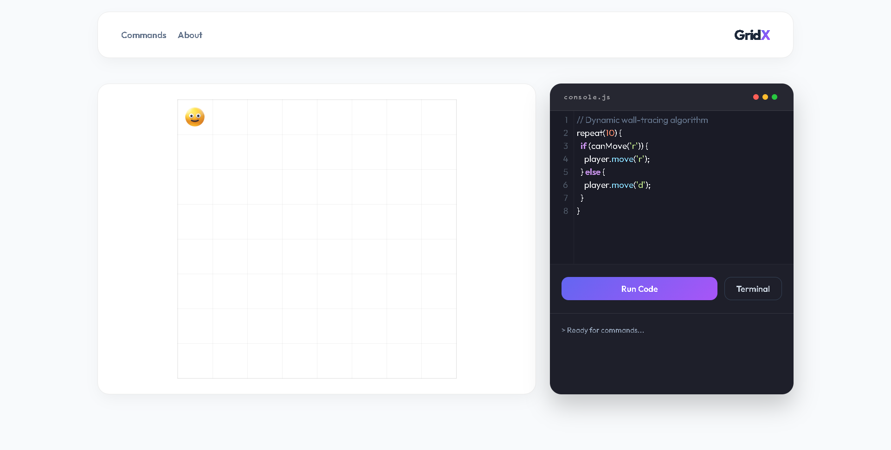

<h1 align="center">Designer fast, Build faster.</h1>

  
  
  

Hi, I'm Yasser 👋  
Frontend Developer & UI/UX Designer crafting modern web experiences.

---

## 🖼️ Featured Work

  
  

  
  

Click any project to explore it live 🚀

---

## 🚀 About Me

- 💻 I build modern, scalable web applications
- 🎨 Passionate about UI/UX and clean design systems
- ⚡ Focused on performance, speed, and simplicity
- 🧠 Always learning and improving

---

## 🛠️ Tech Stack

HTML • CSS • JavaScript • React • Tailwind • Firebase • Git

---

## 🔥 Featured Projects

### 🟣 YasserGPT

AI chat application focused on clean UI and smooth user experience.

### 🟡 ColorLab

A modern tool for generating beautiful and usable color palettes.

### 🔵 GridX

An interactive coding game that teaches logic through real-time movement.

---

## 📫 Contact Me

- Email: [yasserxd653@gmail.com](mailto:yasserxd653@gmail.com)
